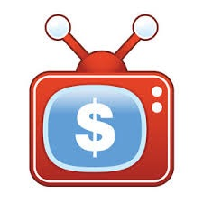

# Money Channel
> Here goes your awesome project description!

## Table of contents
* [General info](#general-info)
* [Screenshots](#screenshots)
* [Technologies](#technologies)
* [Setup](#setup)
* [Features](#features)
* [Status](#status)
* [Inspiration](#inspiration)
* [Contact](#contact)

## General info
The Money Channel Budget Application allows end-users to take better control of their finances through knowledge and motivation. Whether the user is interested in tracking their expenses or planning to save up for something special down the road, this application can help you easily set your budget, log your expenses, and motivate you to your next goal. This application will provide stability to struggling households, as well as, relieve finacial stress off of college students. No more checking your bank account every hour, relax and look forward to your next vacaction with the money channel.

Audience: 
  * College Students
  * Newly Weds
  * Single Parents
## Screenshots

## Technologies
* Tech 1 - version 1.0
* Tech 2 - version 2.0
* Tech 3 - version 3.0

## Setup
Describe how to install / setup your local environement / add link to demo version.

## Code Examples
Show examples of usage:
`put-your-code-here`

## Features
List of features ready and TODOs for future development
* Two-Factor Auth
  *
* Secure Login
  *
* Smooth Icons
  *

To-do list:
* Wow improvement to be done 1
* Wow improvement to be done 2

## Status
Project is: _in progress_

## Inspiration
Add here credits. Project inspired by fellow member Zach Vasquez, based on...

## Contact
Created by Cyberristics (Hydra) - feel free to contact us!
* Mack Scott
* Blake Burns
* Christian Coulter
* Zach Vasquez
* Muhammed Rasheed
